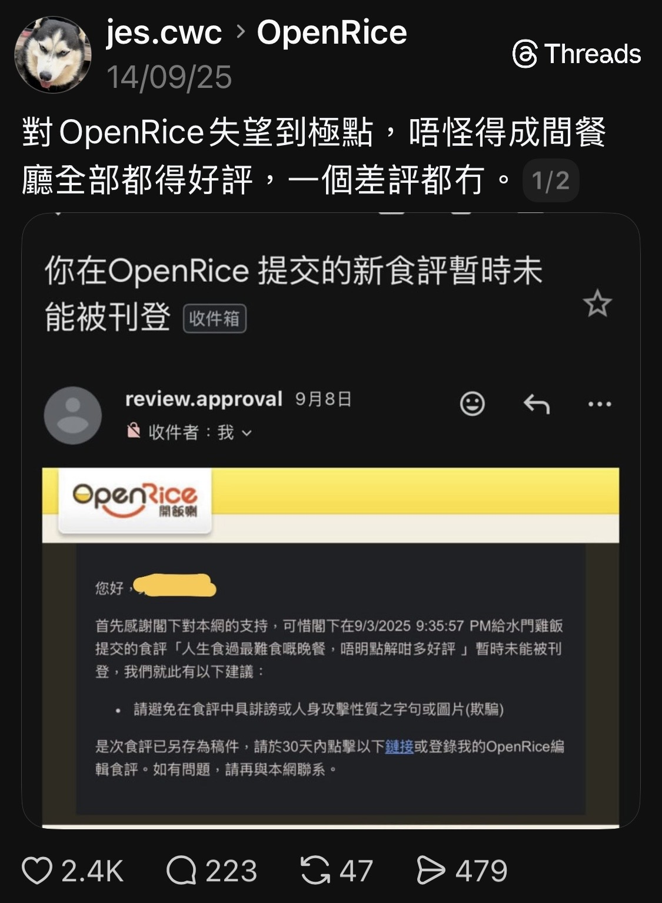
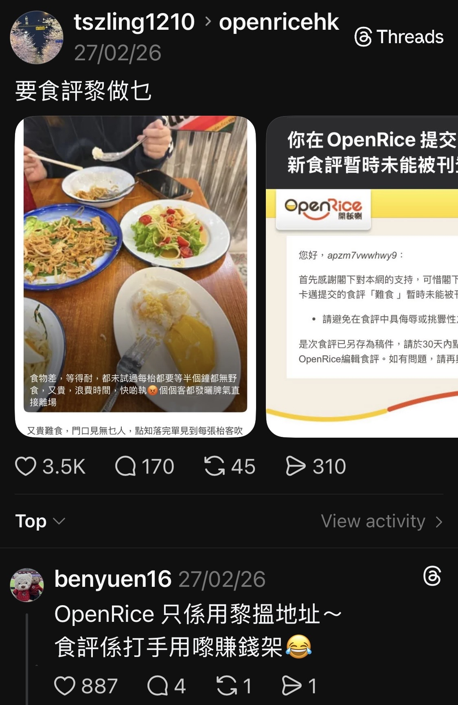
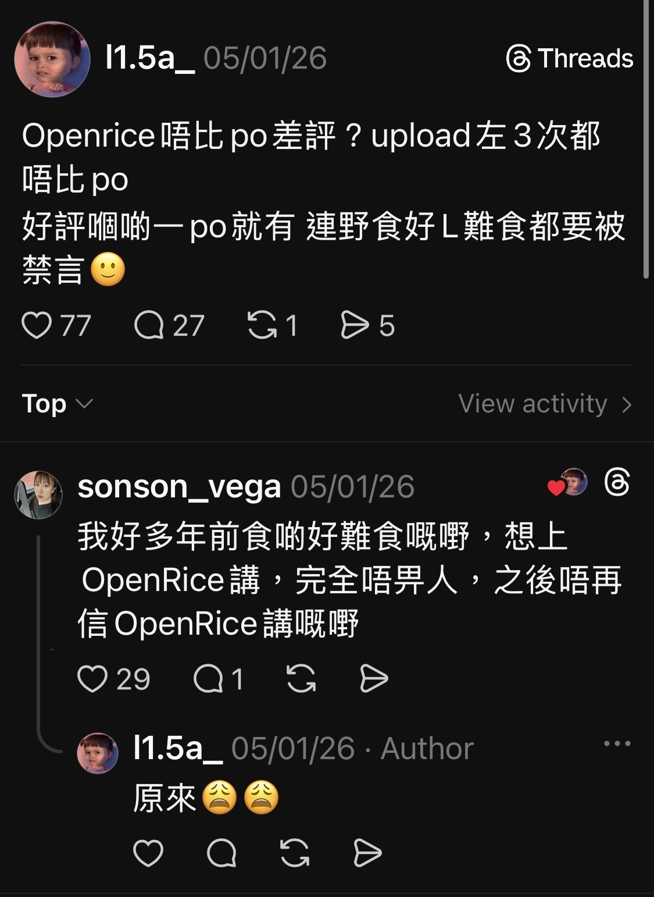

# COMP2501 Project Proposal

**Name:** Kan Chi Fu  
**UID:** 3035807902

# Can You Trust OpenRice?

## 1. Tentative Topic
- **Can you trust OpenRice?**
- This project asks whether OpenRice is more positive than other platforms and whether some reviews may be fake.

## 2. Two Data Science Questions
- **Question 1:** Does OpenRice have systematically more positive reviews or ratings than Google for the same restaurants?
- **Question 2:** Do OpenRice reviews show suspicious patterns that look like fake campaigns or bots?
- Possible signals include review bursts, repeated phrases, generic comments, many new accounts, or unusual reviewer clustering.

## 3. Why the Question Is Important

- There are public concerns that OpenRice may remove bad reviews while also profiting from ads and promotions.
- Customers may be misled by inflated ratings or filtered negative information.
- Small businesses may be harmed if fake campaigns or platform visibility create unfair competition.

## 4. Existing Work
- Related research exists, but most of it focuses on larger global platforms rather than OpenRice itself.
- **Platform differences:** Li and Hecht (2020) show that the same restaurant can receive different scores across platforms.
- **OpenRice-related work:** Chik and Vasquez (2017) show that OpenRice's design can shape review content.
- **Bot detection:** Aljabri et al. (2023) review machine learning methods for finding bots through behavior and account patterns.
- **Textual analysis:** Fernquist (2016) studies deceptive reviews with NLP, while Qiu, Zhang, and Huang (2013) provide tools for Chinese text.

## 5. Difficulties
- Scraping may be blocked or limited.
- Fake reviews can look natural, especially in Chinese, so Chinese NLP tools or translation may be needed.
- Review patterns can change over time.
- The dataset may be too large, so recent data or only part of the restaurants may be sampled.
- Ratings may differ across platforms even with the same 5-star scale.
- Restaurants differ by cuisine, size, and customer base.

## 6. Data Availability
- Data may be collected by scraping with a vibe-a-bot approach.
- Useful fields include restaurant name, rating, review text, timestamps, reviewer activity, and business features from OpenRice and Google.
